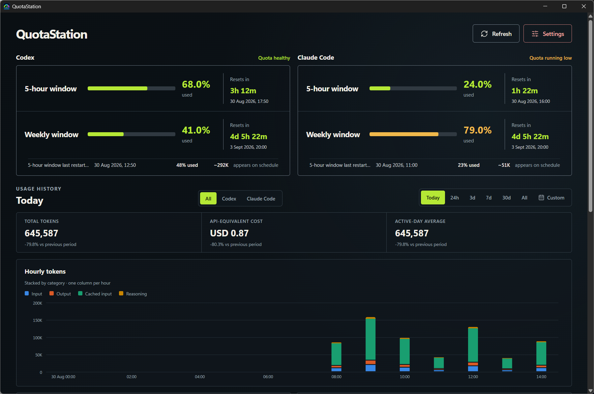
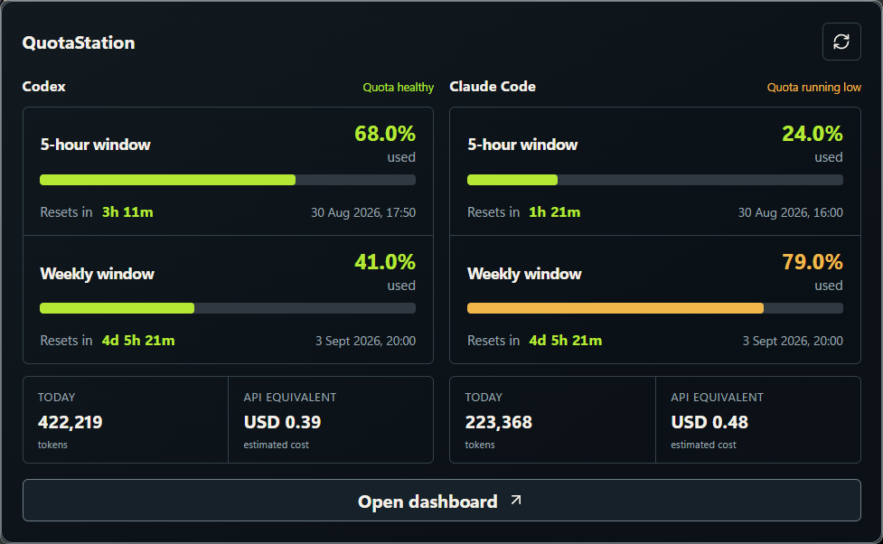

# QuotaStation

A Windows app for tracking AI coding quotas, reset times, token usage, and estimated API
costs. All usage history stays on your computer.

QuotaStation currently supports Codex and Claude Code. It brings their current limits and
local usage history into one dashboard, with smaller views available from the system tray and
Windows taskbar.

## Features

- See how much of each quota window has been used and exactly when it resets.
- Open a compact panel from the system tray or keep an optional status widget in the taskbar.
- Show quota, context, model, and Git details in the Claude Code status line.
- Review hourly usage for recent ranges and daily usage for longer ranges.
- Compare providers, models, token categories, devices, and the previous period.
- Keep a history of scheduled and possible early quota resets.
- Export diagnostics that leave out credentials, account details, prompts, source code, and
  private file paths.
- Combine totals from several Windows computers through a folder managed by Proton Drive,
  Syncthing, or another file-sync tool.

## Install

Download the latest `QuotaStation_X.Y.Z_x64-setup.exe` from the
[releases page](https://github.com/SteveWang92/QuotaStation/releases/latest) and run it. The
installer is for 64-bit Windows 10 or later, installs for the current user, and does not need
administrator rights. Windows 11 already includes the required WebView2 runtime.

Install and sign in to whichever supported client you want to monitor:

- Put the official Codex CLI on `PATH` to read Codex quotas and usage.
- Install Claude Code to read its local usage history. Quota percentages become available
  when its optional QuotaStation status line is enabled and Claude Code supplies them.

QuotaStation reads local session records and receives quota data from the clients through
local interfaces. It does not log in to provider accounts, handle their credentials, or
change their settings unless you explicitly enable or remove the Claude Code status line.

The installer is unsigned, so Microsoft Defender SmartScreen may show a warning. On systems
that allow unsigned applications, choose **More info** and then **Run anyway** after confirming
that the download came from this repository. Some managed computers may block unsigned apps
entirely. [Development](docs/development.md#packaging-and-distribution) explains the signing
decision.

Install a newer release over the existing one to update without losing settings or history.
Uninstalling removes QuotaStation's shortcuts, Windows startup entry, and the Claude Code
status line or notification hook it installed. Local history and settings are kept by default;
select **Delete app data** in the uninstaller if you want those removed too.

## Privacy

- Usage history, quota readings, settings, and logs stay on the local computer.
- QuotaStation does not include an HTTP client or call provider APIs directly.
- Provider credentials remain with the installed client or the operating system.
- Prompts, source code, raw sessions, account details, and complete file paths are not stored
  in QuotaStation's database or diagnostic export.
- Multi-machine sharing sends only hourly and daily totals through the folder you choose.

## Documentation

- [Architecture](docs/architecture.md)
- [Development](docs/development.md)
- [Multi-machine usage](docs/multi-machine.md)
- [Contributing](CONTRIBUTING.md)
- [Security policy](SECURITY.md)
- [Support](SUPPORT.md)
- [Third-party notices](THIRD_PARTY_NOTICES.md)

## Contributing

QuotaStation uses Tauri 2, Rust, React, TypeScript, Vite, and SQLite. See
[CONTRIBUTING.md](CONTRIBUTING.md) before opening an issue or pull request.

## License

Copyright (C) 2026 Steve Wang.

QuotaStation is licensed under the [GNU Affero General Public License v3.0 only](LICENSE).
